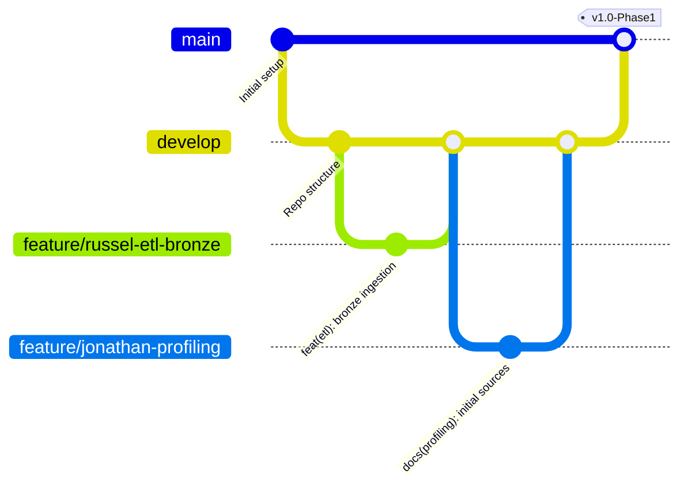

# 🛡️ Best Practices, Git Workflow & Code Standards

## Team: Sunchos Team | Mérida Urban Intelligence

To ensure full reproducibility, high code quality, security of secrets, and compliance with 100% of the project rubric (especially the **20 points for Git collaboration**), all team members must follow these guidelines.

---

## 🌿 1. Git Branching Strategy

We follow a simplified **GitFlow / GitHub Flow** model:



### Branch Conventions:
1. `main`: Stable production branch. Only receives merges from `develop` or tagged phase releases via Pull Request.
2. `develop`: Active integration branch. All feature branches converge here.
3. `feature/<member>-<feature-name>`: Dedicated individual branch.
   - *Examples:*
     - `feature/russel-docker-etl`
     - `feature/rivaldo-moran-endpoints`
     - `feature/damian-maplibre-choropleth`
     - `feature/bianca-kpi-charts`
     - `feature/jonathan-data-dictionary`
4. `fix/<member>-<issue>`: Targeted bug fixes.

> [!CAUTION]
> **Direct `git push` to `main` or `develop` is strictly forbidden.** All changes must be integrated via **Pull Request (PR)** with at least 1 team review.

---

## 📝 2. Commit Message Standards (Conventional Commits)

Every commit must be atomic (one logical change) and adhere to the conventional format:

```text
<type>(<scope>): <concise description in lowercase and imperative mood>

[optional body explaining the motivation or technical context]
```

### Allowed Types:
* `feat`: New feature or capability (e.g., `feat(etl): add point-to-polygon spatial join for crime data`)
* `fix`: Bug fix (e.g., `fix(moran): handle isolated polygons with zero neighbors in weight matrix`)
* `docs`: Documentation only changes (e.g., `docs(dictionary): document fact_demografia fields`)
* `style`: Code style, whitespace, formatting (no logic changes)
* `refactor`: Refactoring code without adding features or fixing bugs
* `perf`: Performance improvements (e.g., `perf(postgis): add gist index on geom_4326 in dim_geografia`)
* `test`: Adding or updating test cases
* `chore`: Build tasks, package updates, CI/CD configuration (e.g., `chore(ci): update github actions workflow`)

### Good vs Bad Examples:
* ✅ `feat(backend): add bivariate moran endpoint for crime vs business density`
* ✅ `docs(readme): add docker reproduction instructions and env setup`
* ❌ `changes ready` (Do not use generic messages)
* ❌ `uploading files` (Does not explain the change)
* ❌ `final commit` (Makes tracking impossible)

---

## 🔒 3. Secret Management & Security

1. **NEVER commit `.env` or plain database credentials**:
   - Ensure `.env` is listed in `.gitignore` before creating local config files.
   - Share new variable names using dummy values in `.env.example`.
2. **GitHub Actions Secrets**:
   - Production keys (`SUPABASE_SERVICE_ROLE_KEY`, `DATABASE_URL`, `VERCEL_TOKEN`) must only be configured in **GitHub Settings > Secrets and variables > Actions**.
3. **Supabase Key Scopes**:
   - `NEXT_PUBLIC_SUPABASE_PUBLISHABLE_KEY` (Anon): Safe for Frontend use.
   - `SUPABASE_SERVICE_ROLE_KEY`: **Backend / ETL only**. Provides administrative privileges and must never be exposed on the client.

---

## 🐍 4. Code Quality & Technical Standards

### Backend & ETL (Python)
* **Version:** Python 3.10+
* **Style Guide:** Follow **PEP 8**.
* **Spatial Geometry Management with GeoPandas / Shapely**:
  - Always validate the Coordinate Reference System (**CRS**).
  - Store spatial data in standard **WGS84 (`EPSG:4326`)** for PostGIS and GeoJSON.
  - For distance or area calculations in Mérida, project to **UTM Zone 16N (`EPSG:32616`)** or **Mexico ITRF2008 (`EPSG:6372`)**.
* **Dependency Management**:
  - Pin versions in `requirements.txt` (e.g., `geopandas==1.0.1`, `fastapi==0.115.0`).

### Database & SQL (PostgreSQL / PostGIS)
* SQL keywords in **UPPERCASE** (`SELECT`, `FROM`, `WHERE`, `JOIN`, `CREATE TABLE`).
* Table and column names in **lowercase snake_case** (`cvegeo`, `total_poblacion`, `geom_4326`).
* All spatial geometry columns must have a **GIST index**:
  ```sql
  CREATE INDEX idx_dim_geografia_geom4326 ON dim_geografia USING GIST(geom_4326);
  ```
* Analytical metrics must be computed from Data Warehouse tables and views, not recalculated on raw CSVs.

### Frontend (React / Next.js)
* Modular component architecture in `src/frontend/components/`.
* Clear separation between GIS layers (**MapLibre GL JS**), metric widgets (**ApexCharts**), and API callers.
* Proper cleanup of map instances and event listeners in `useEffect` to prevent memory leaks.

---

## 📦 5. Reproducibility & Docker Environment

* The complete ETL pipeline must be reproducible with a single Docker command:
  ```bash
  docker compose up --build
  ```
* **Raw Source Invariance**: Datasets downloaded from INEGI or Public Safety must remain untouched in `data/raw/`. No script should overwrite raw data.
* **Traceability**: All transformations (cleaning, CRS reprojecting, spatial joining, aggregation) must be codified in executable, documented scripts.

---

## 👥 6. Pull Request (PR) Checklist

Before requesting a PR review:
- [ ] Does the code run locally without errors?
- [ ] Were `requirements.txt` or `package.json` updated if new dependencies were added?
- [ ] Are no secrets or temporary files staged (`git status`)?
- [ ] Do commit messages follow Conventional Commits?
- [ ] Were documentation files updated (`README.md`, `docs/data_dictionary.md`) if schemas changed?
- [ ] Did all automated GitHub Actions CI checks pass?
