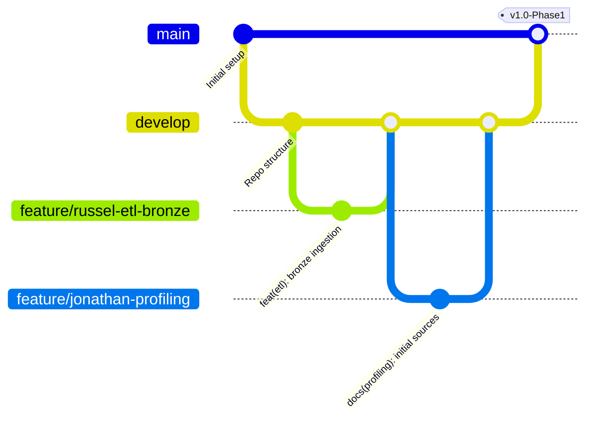

# 🛡️ Guía de Buenas Prácticas, Flujo de Trabajo Git y Estándares

## Equipo: Sunchos Team | Mérida Urban Intelligence

Para garantizar la reproducibilidad, la calidad del código, la seguridad de las credenciales y el cumplimiento del 100% de la rúbrica de evaluación (especialmente los **20 puntos de colaboración en Git**), todo el equipo debe seguir estrictamente estas directrices.

---

## 🌿 1. Estrategia de Ramas (Git Branching Model)

Trabajaremos bajo una adaptación simplificada de **GitHub Flow / GitFlow**:



### Reglas de Ramas:
1. `main`: Rama de producción estable. Solo recibe merges validados mediante Pull Request desde `develop` o releases de fin de fase.
2. `develop`: Rama de integración activa. Aquí convergen los features del equipo.
3. `feature/<miembro>-<nombre-corto>`: Rama individual de trabajo.
   - *Ejemplos:*
     - `feature/russel-docker-etl`
     - `feature/rivaldo-moran-endpoints`
     - `feature/damian-maplibre-choropleth`
     - `feature/bianca-kpi-charts`
     - `feature/jonathan-data-dictionary`
4. `fix/<miembro>-<descripcion>`: Correcciones puntuales de bugs.

> [!CAUTION]
> **PROHIBIDO hacer `git push` directo a `main` o `develop`.** Todo cambio debe entrar por un **Pull Request (PR)** con al menos 1 aprobación del equipo.

---

## 📝 2. Convención de Commits (Conventional Commits)

Cada commit debe ser atómico (un solo cambio lógico) y utilizar el formato estándar:

```text
<tipo>(<alcance>): <descripción concisa en minúsculas y presente>

[cuerpo opcional explicando el porqué del cambio]
```

### Tipos Permitidos:
* `feat`: Nueva funcionalidad (ej. `feat(etl): add point-to-polygon spatial join for crime data`)
* `fix`: Corrección de un error (ej. `fix(moran): handle isolated polygons with zero neighbors in weight matrix`)
* `docs`: Cambios exclusivamente en documentación (ej. `docs(dictionary): document fact_demografia fields`)
* `style`: Formato, espacios, comas (sin cambio en lógica de código)
* `refactor`: Refactorización de código sin añadir features ni corregir bugs
* `perf`: Mejora de rendimiento (ej. `perf(postgis): add gist index on geom_4326 in dim_geografia`)
* `test`: Adición o modificación de pruebas unitarias o de integración
* `chore`: Tareas de configuración, dependencias o CI/CD (ej. `chore(ci): update github actions workflow`)

### Ejemplos Correctos e Incorrectos:
* ✅ `feat(backend): add bivariate moran endpoint for crime vs business density`
* ✅ `docs(readme): add docker reproduction instructions and env setup`
* ❌ `cambios listos` (No usar mensajes genéricos)
* ❌ `subiendo cosas` (No describe el cambio)
* ❌ `commit final` (Imposibilita rastrear el trabajo)

---

## 🔒 3. Seguridad y Manejo de Secretos

1. **NUNCA comitear archivos `.env` o credenciales reales**:
   - Asegúrate de que `.env` esté en `.gitignore` antes de crear cualquier archivo.
   - Para compartir variables nuevas con el equipo, agrégalas con valores ficticios en `.env.example`.
2. **Uso de Secretos en GitHub Actions**:
   - Las llaves de producción (`SUPABASE_SERVICE_ROLE_KEY`, `DATABASE_URL`, `VERCEL_TOKEN`) se configuran únicamente en **GitHub Settings > Secrets and variables > Actions**.
3. **Roles en Supabase**:
   - `NEXT_PUBLIC_SUPABASE_PUBLISHABLE_KEY` (Anon): Segura para el Frontend.
   - `SUPABASE_SERVICE_ROLE_KEY`: **Exclusiva del Backend / ETL**. Da acceso administrativo y jamás debe exponerse en el cliente web.

---

## 🐍 4. Estándares de Código y Desarrollo

### Backend & ETL (Python)
* **Versión:** Python 3.10+
* **Guía de estilo:** Seguir **PEP 8**.
* **Manejo de Geometrías con GeoPandas / Shapely**:
  - Validar siempre el sistema de coordenadas de referencia (**CRS**).
  - Almacenar en coordenadas geográficas estándar **WGS84 (`EPSG:4326`)** para PostGIS y GeoJSON.
  - Para cálculos métricos de distancia o área en Mérida, proyectar a **UTM Zone 16N (`EPSG:32616`)** o **CCL México (`EPSG:6372`)**.
* **Gestión de Dependencias**:
  - Registrar librerías en `requirements.txt` fijando versiones (ej. `geopandas==1.0.1`, `fastapi==0.115.0`).

### Base de Datos & SQL (PostgreSQL / PostGIS)
* Palabras clave de SQL en **MAYÚSCULAS** (`SELECT`, `FROM`, `WHERE`, `JOIN`, `CREATE TABLE`).
* Nombres de tablas y columnas en **minúsculas con snake_case** (`cvegeo`, `total_poblacion`, `geom`).
* Todo campo espacial debe tener un índice espacial **GIST**:
  ```sql
  CREATE INDEX idx_dim_geografia_geom ON dim_geografia USING GIST(geom);
  ```
* Las métricas analíticas deben calcularse desde el Data Warehouse (tablas/vistas SQL), no recalculando sobre archivos crudos.

### Frontend (React / Next.js)
* Estructura modular de componentes en `src/frontend/components/`.
* Separación clara entre capas de visualización (**MapLibre GL JS**), componentes de métricas (**ApexCharts**) y llamadas a API.
* Limpieza de referencias y listeners de mapas en `useEffect` para evitar fugas de memoria.

---

## 📦 5. Reproducibilidad y Entorno Docker

* Todo el pipeline de ETL debe ser reproducible mediante un solo comando con Docker:
  ```bash
  docker compose up --build
  ```
* **Preservación de fuentes crudas**: Los archivos descargados de INEGI o Seguridad deben residir intactos en `data/raw/`. Ningún script debe sobreescribir los archivos crudos originales.
* **Trazabilidad**: Toda transformación (limpieza, imputación de nulos, cambio de CRS, agregación espacial) debe quedar registrada en código ejecutable documentado.

---

## 👥 6. Checklist para Pull Requests (PR)

Antes de solicitar la revisión de un PR:
- [ ] ¿El código corre localmente sin errores?
- [ ] ¿Se actualizaron las dependencias en `requirements.txt` o `package.json` si se agregaron nuevas librerías?
- [ ] ¿No se filtró ningún secreto o archivo temporal en el staging (`git status`)?
- [ ] ¿Los commits siguen la convención Conventional Commits?
- [ ] ¿Se actualizó la documentación pertinente (`README.md`, `docs/data_dictionary.md`) si hubo cambios estructurales?
- [ ] ¿Pasan todas las verificaciones automáticas de GitHub Actions CI?
