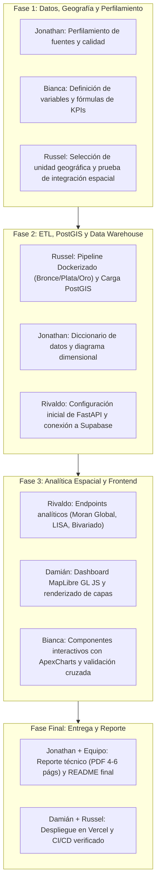

# 👥 Distribución del Equipo y Matriz de Responsabilidades

## Proyecto: Mérida Urban Intelligence — Geospatial Data Warehouse & Analytics Platform

Este documento define los roles, entregables, compromisos y la estrategia de colaboración del equipo **Sunchos Team** para asegurar el cumplimiento del 100% de la rúbrica del proyecto, garantizando que cada miembro tenga contribuciones técnicas e individuales verificables en el historial de Git a lo largo de todas las fases.

---

## 🧭 Resumen de Roles y Complejidad

| Miembro | Rol Principal | Nivel de Complejidad | Fases Clave | Tecnologías Principales |
| :--- | :--- | :--- | :--- | :--- |
| **Russel** | **Arquitectura de Datos & ETL** | Alta | Fase 1 y 2 | Docker, Python, GeoPandas, Supabase (PostgreSQL / PostGIS) |
| **Rivaldo** | **Backend & Análisis Espacial** | Alta | Fase 2 y 3 | FastAPI, Python (PySAL, libpysal, esda), Supabase SDK |
| **Damián** | **Frontend & Mapas Interactivos** | Alta | Fase 3 | React / Next.js, MapLibre GL JS, Vercel, Tailwind / CSS |
| **Bianca** | **Análisis de Datos & Gráficas** | Media | Fase 1 y 3 | Python (Profiling), React, ApexCharts, Pandas |
| **Jonathan** | **Documentación & Perfilamiento** | Media | Fase 1 y Final | Data Profiling, Diagramas ERD/Dimensional, Markdown, LaTeX/PDF |

---

## 📋 Matriz de Responsabilidades por Fase

---

## 🎯 Detalle Individual de Entregables

### 1. Russel — *Data Architect & Lead ETL Engineer*
* **Fase 1**:
  - Evaluación y justificación técnica de la unidad geográfica óptima (AGEB vs Cuadrantes vs Manzanas).
  - Script de prueba de integración espacial de puntos de criminalidad hacia polígonos de Mérida.
* **Fase 2**:
  - Diseño y construcción del entorno reproducible en **Docker** (`Dockerfile`, `docker-compose.yml`).
  - Implementación del pipeline **ETL con Arquitectura Medallón**:
    - *Capa Bronce*: Ingesta de fuentes crudas sin mutación (INEGI Censo 2020, DENUE, Cartografía, Incidencias Delictivas).
    - *Capa Plata*: Limpieza, estandarización de tipos, normalización de CRS (EPSG:4326 / EPSG:6372), joins espaciales.
    - *Capa Oro*: Carga a tablas dimensionales y de hechos en **PostgreSQL / PostGIS** (Supabase).
  - Scripts SQL de DDL (`sql/01_schema.sql`), índices espaciales GIST y carga (`sql/02_load.sql`).
* **Fase 3 & Final**:
  - Soporte en optimización de consultas espaciales en PostGIS y vistas analíticas (`sql/03_views.sql`).

---

### 2. Rivaldo — *Backend & Geospatial Analytics Engineer*
* **Fase 2**:
  - Estructuración del servidor **FastAPI** (`src/backend/`).
  - Conexión al Data Warehouse de Supabase mediante pool de conexiones y Supabase SDK.
  - Endpoints REST para servir metadatos, polígonos GeoJSON y KPIs consolidados.
* **Fase 3**:
  - Implementación de algoritmos de **Autocorrelación Espacial** usando **PySAL** (`libpysal`, `esda`):
    - **Global Moran's I**: Cálculo de estadístico $I$, p-value y z-score para al menos 2 indicadores territoriales.
    - **Local Moran's I (LISA)**: Identificación de clusters espaciales (High-High, Low-Low) y outliers espaciales (High-Low, Low-High).
    - **Bivariate Moran's I**: Relación espacial entre variables cruzadas (ej. Actividad Económica vs Criminalidad, o Densidad Poblacional vs Delitos).
  - Definición y justificación de la matriz de pesos espaciales (Queen / Rook o k-Nearest Neighbors).
  - Exposición de endpoints analíticos de alta velocidad para consumo del frontend.

---

### 3. Damián — *Frontend & GIS Visualization Engineer*
* **Fase 2**:
  - Inicialización del proyecto Frontend (**React / Next.js**) con soporte para variables de entorno de Supabase.
  - Configuración del pipeline de despliegue continuo en **Vercel**.
* **Fase 3**:
  - Integración de **MapLibre GL JS** / Deck.gl para visualización de mapas coropléticos interactivos.
  - Carga y renderizado dinámico de capas GeoJSON (polígonos de Mérida, mapa de calor de delitos, clusters LISA).
  - Interfaz de usuario responsiva con selector de indicadores, tooltips interactivos, control de opacidad y filtros temporales/por categoría.
  - Manejo de estado global del mapa y sincronización con el panel de analítica.

---

### 4. Bianca — *Data Analyst & Data Visualization Specialist*
* **Fase 1**:
  - Auditoría de datos: perfilamiento de variables numéricas y categóricas de INEGI Censo y DENUE.
  - Mapeo y formulación matemática de los 12+ KPIs requeridos por la especificación:
    - *Demográficos*: Población total, densidad, PEA, distribución por grupos de edad.
    - *Económicos*: Total de establecimientos, densidad de comercios, negocios por 1,000 hab., actividades dominantes.
    - *Seguridad*: Tasa delictiva por 1,000 hab., distribución temporal de delitos, ratio delito/negocio.
* **Fase 3**:
  - Desarrollo de componentes de visualización interactiva usando **ApexCharts** en React.
  - Creación de gráficos comparativos: correlaciones (Pearson/Spearman), barras de actividad económica, series de tiempo de delitos, pirámides poblacionales.
  - Validación cruzada de los resultados del frontend contra las consultas SQL del Data Warehouse.

---

### 5. Jonathan — *QA, Profiling & Technical Documentation Lead*
* **Fase 1**:
  - Evaluación inicial de calidad de fuentes (análisis de valores nulos, duplicados, inconsistencias en CRS y claves geoestadísticas CVEGEO).
  - Creación del **Diccionario de Datos** completo (`docs/data_dictionary.md`).
* **Fase 2**:
  - Modelado y documentación del **Modelo Dimensional** (Diagrama ERD en Mermaid / PNG de tablas `dim_geografia`, `dim_tiempo`, `dim_actividad_economica`, `fact_demografia`, `fact_crimen`, `fact_negocios`).
  - Redacción de consultas de validación de integridad referencial.
* **Fase Final**:
  - Redacción y maquetación del **Reporte Técnico Final (4 a 6 páginas en PDF)** cubriendo objetivos, metodología, arquitectura DW, análisis espacial y conclusiones.
  - Mantenimiento y actualización continua del `README.md` del repositorio.

---

## ⚡ Estrategia Anti-Cuellos de Botella (Flujo Paralelo)

Para evitar que el equipo se detenga mientras se construyen los componentes base:

1. **Semana 1 (Fase 1)**:
   - Mientras **Russel** monta el entorno Docker y prueba el spatial join con scripts mínimos, **Jonathan** y **Bianca** trabajan directamente en notebooks (`notebooks/01_data_profiling.ipynb`) auditando los CSVs y definiendo las fórmulas exactas.
2. **Semana 2 (Fase 2)**:
   - Mientras **Russel** carga los datos procesados en Supabase PostGIS, **Rivaldo** estructura la API en FastAPI con mocks iniciales y **Jonathan** escribe el `data_dictionary.md` y diagrama dimensional.
3. **Semana 3 (Fase 3)**:
   - **Rivaldo** conecta FastAPI a PostGIS y calcula los índices de Moran en Python.
   - **Damián** monta el lienzo del mapa en React con MapLibre GL JS y **Bianca** construye las tarjetas de KPIs y gráficas en ApexCharts.
4. **Semana 4 (Fase Final)**:
   - **Jonathan** redacta el reporte técnico de 4 a 6 páginas integrando mapas generados por Damián, análisis de Moran de Rivaldo, y tablas de validación de Bianca y Russel.

---

## 📊 Rúbrica y Distribución de Puntos (100 pts)

| Componente de Evaluación | Puntos | Responsables Clave |
| :--- | :---: | :--- |
| **Data & Geographic Assessment** | 15 pts | Russel, Bianca, Jonathan |
| **ETL, Spatial Integration & Reproducibility** | 20 pts | Russel |
| **PostgreSQL/PostGIS DW Design & Implementation** | 20 pts | Russel, Jonathan |
| **KPIs & Spatial Analysis (Moran / LISA)** | 15 pts | Rivaldo, Bianca |
| **Repository Collaboration & Git History** | 20 pts | **Todo el equipo (100% obligatorio)** |
| **Documentation & Technical Report** | 10 pts | Jonathan, Todo el equipo |
| **TOTAL** | **100 pts** | |

> [!IMPORTANT]
> **Criterio Estricto de Calificación Git:**
> El 20% de la calificación depende del historial de commits individuales. Todos los miembros deben crear ramas propias (`feature/...`), enviar Pull Requests y registrar commits descriptivos en cada fase. Repositorios con un solo autor o commits masivos al final pierden automáticamente este puntaje.
