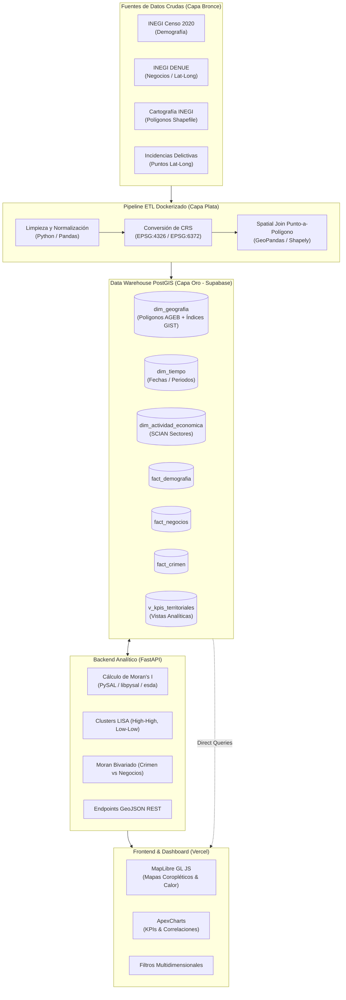
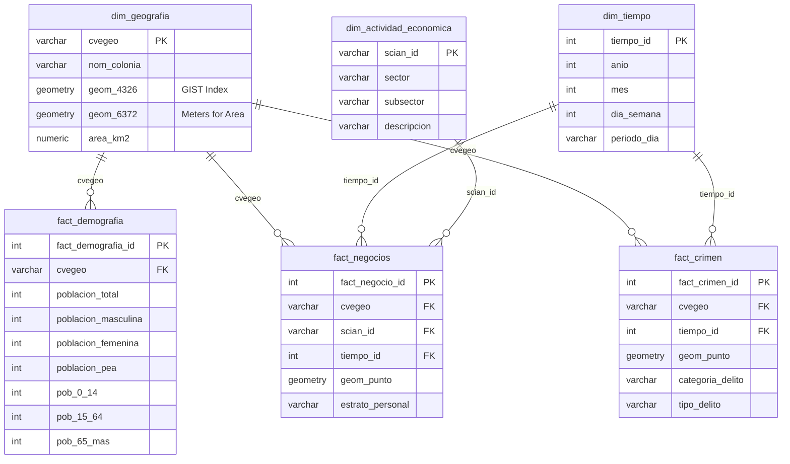

# 🏙️ Mérida Urban Intelligence: Geospatial Data Warehouse & Analytics Platform

[](https://github.com/RusselKu/Merida-Urben-Intelligence-By-Sunchos-Team/actions/workflows/ci.yml)
[](https://www.postgresql.org/)
[](https://postgis.net/)
[](https://fastapi.tiangolo.com/)
[](https://reactjs.org/)
[](https://maplibre.org/)
[](https://vercel.com/)

---

## 📌 1. Visión General del Proyecto

**Mérida Urban Intelligence** es una plataforma integral de inteligencia territorial y Data Warehouse Geoespacial diseñada para la ciudad de Mérida, Yucatán. El sistema resuelve el desafío crítico de integrar fuentes de datos heterogéneas que operan a distintas escalas espaciales y formatos (registros puntuales de latitud/longitud vs. polígonos geoestadísticos oficiales) para evaluar correlaciones socioespaciales, patrones de actividad económica y distribución de la criminalidad.

### Objetivos Analíticos:
1. **Consolidación Geoespacial**: Integrar fuentes demográficas (INEGI Censo), económicas (INEGI DENUE), cartográficas y de seguridad pública en una unidad geográfica estandarizada.
2. **Data Warehouse Dimensional**: Modelar e implementar un esquema estrella/copo de nieve en **PostgreSQL con PostGIS habilitado** alojado en **Supabase**.
3. **Analítica Espacial Avanzada**: Calcular métricas de autocorrelación espacial global y local (**Índice de Moran Global, LISA y Moran Bivariado**) mediante un backend en **FastAPI** impulsado por **PySAL / GeoPandas**.
4. **Visualización Interactiva**: Desplegar un Dashboard en **React + MapLibre GL JS + ApexCharts** alojado en **Vercel** para la toma de decisiones basada en evidencia territorial.

---

## 🏗️ 2. Arquitectura del Sistema y Stack Tecnológico



---

## 🗺️ 3. Estrategia Geográfica e Integración Espacial

### Selección de la Unidad de Análisis Territorial
Para conciliar las distintas granularidades de los datos disponibles, se evaluaron tres alternativas:

| Unidad Geográfica | Ventajas | Desventajas | Decisión |
| :--- | :--- | :--- | :--- |
| **Manzana (Nivel micro)** | Máxima resolución espacial. | Alto porcentaje de datos demográficos censurados por confidencialidad (secreto estadístico INEGI); polígonos complejos. | Descartada |
| **AGEB Urbana (Área Geoestadística Básica)** | Disponibilidad completa de variables censales (PEA, grupos de edad); límites oficiales validados; balance ideal entre detalle y significancia estadística. | Variación en el tamaño físico de los polígonos hacia la periferia. | **SELECCIONADA (Recomendada)** |
| **Cuadrantes / Grillas Hexagonales (H3)** | Celdas de área homogénea que mitigan el MAUP. | Desconectadas de los límites censales oficiales de INEGI; requiere imputación/interpolación espacial con pérdida de precisión. | Descartada para DW base |

### Integración Punto-a-Polígono (Spatial Join)
1. **Normalización de Coordenadas (CRS)**: Se reciben registros puntuales de DENUE e incidencias de criminalidad en coordenadas geográficas `WGS84` (`EPSG:4326`).
2. **Validación de Geometría**: Tratamiento de puntos nulos, fuera de rango o ubicados fuera del municipio de Mérida.
3. **Cruce Espacial**: Ejecución de predicado topológico `ST_Within(point, polygon)` o `gpd.sjoin(how='inner', predicate='within')` asignando a cada registro puntual el identificador único `cvegeo` del AGEB correspondiente.

---

## 🗄️ 4. Modelo Dimensional del Data Warehouse (PostgreSQL / PostGIS)

El Data Warehouse implementa un modelo multidimensional optimizado para consultas analíticas de agregación y análisis espacial:



---

## 📊 5. Indicadores Clave de Rendimiento (KPIs Requeridos)

| Categoría | KPI | Fórmula / Definición | Grano de Salida |
| :--- | :--- | :--- | :--- |
| **Demografía** | **Población Total** | $\sum \text{Población por AGEB}$ | AGEB |
| **Demografía** | **Densidad de Población** | $\frac{\text{Población Total}}{\text{Área en } \text{km}^2}$ | Hab / $\text{km}^2$ |
| **Demografía** | **Tasa de PEA** | $\frac{\text{Población Económicamente Activa (PEA)}}{\text{Población } \ge 12 \text{ años}} \times 100$ | Porcentaje (%) |
| **Demografía** | **Población por Grupo de Edad** | Conteo y proporción en cohortes: `0-14`, `15-64`, `65+` | AGEB |
| **Economía** | **Total de Negocios** | $\text{Count}(\text{Establecimientos DENUE})$ | Conteo por AGEB |
| **Economía** | **Densidad de Negocios** | $\frac{\text{Total de Negocios}}{\text{Área en } \text{km}^2}$ | Negocios / $\text{km}^2$ |
| **Economía** | **Negocios por 1,000 Habitantes** | $\frac{\text{Total de Negocios}}{\text{Población Total}} \times 1,000$ | Tasa por 1k hab. |
| **Economía** | **Densidad Comercial (Retail)** | $\frac{\text{Establecimientos Sector Comercio (SCIAN 46-47)}}{\text{Área en } \text{km}^2}$ | Comercios / $\text{km}^2$ |
| **Economía** | **Densidad de Servicios** | $\frac{\text{Establecimientos Sector Servicios (SCIAN 54-81)}}{\text{Área en } \text{km}^2}$ | Servicios / $\text{km}^2$ |
| **Economía** | **Actividad Económica Dominante** | $\text{Mode}(\text{Sector SCIAN})$ con mayor presencia | Sector dominante |
| **Seguridad** | **Total de Incidencias Delictivas** | $\sum \text{Delitos asignados al polígono}$ | Conteo por AGEB |
| **Seguridad** | **Tasa Delictiva** | $\frac{\text{Total de Delitos}}{\text{Población Total}} \times 1,000$ | Delitos / 1k hab. |
| **Seguridad** | **Distribución Temporal y Tipo** | Delitos agrupados por categoría y periodo horario | Distribución |
| **Seguridad** | **Ratio Delito / Actividad Económica** | $\frac{\text{Total de Delitos}}{\text{Total de Negocios}}$ | Índice relativo |

---

## 🔬 6. Analítica Espacial (Fase 3)

1. **Matriz de Pesos Espaciales ($W$)**: Se emplea una matriz de contigüidad **Queen** de primer orden sobre los polígonos de Mérida, estandarizada por filas ($W_{std}$).
2. **Índice de Moran Global**:
   $$I = \frac{n}{\sum_{i} \sum_{j} w_{ij}} \frac{\sum_{i} \sum_{j} w_{ij} (x_i - \bar{x})(x_j - \bar{x})}{\sum_{i} (x_i - \bar{x})^2}$$
   Evaluación de la hipótesis nula de aleatoriedad espacial con pseudo p-valores mediante permutaciones de Monte Carlo ($999$ iteraciones).
3. **Análisis Local de Autocorrelación Espacial (LISA / Local Moran's I)**:
   - **High-High (Hotspots)**: AGEBs con altos valores rodeados de vecinos con altos valores.
   - **Low-Low (Coldspots)**: AGEBs con bajos valores rodeados de vecinos con bajos valores.
   - **Outliers Espaciales**: *High-Low* y *Low-High*.
4. **Moran Bivariado**:
   Evaluación de la correlación espacial cruzada entre la variable independiente espacialmente rezagada $W y$ y la variable objetivo $x$ (ej. Concentración Comercial vs Delincuencia Patrimonial).

---

## 📂 7. Estructura del Repositorio

```text
merida-urban-intelligence/
├── .github/
│   └── workflows/
│       └── ci.yml                 # Pipeline automatizado de CI/CD
├── data/
│   ├── raw/                       # Fuentes crudas inmutables (Censo, DENUE, Shapefiles)
│   └── processed/                 # GeoJSONs y capas intermedias generadas
├── docs/
│   ├── data_dictionary.md         # Diccionario de datos y especificación de campos
│   └── warehouse_model.png        # Diagrama entidad-relación dimensional
├── notebooks/
│   ├── 01_data_profiling.ipynb    # Auditoría inicial y calidad de fuentes
│   ├── 02_spatial_join_test.ipynb # Pruebas de integración punto a polígono
│   └── 03_moran_analytics.ipynb   # Cálculos de Moran Global, LISA y Bivariado
├── outputs/
│   ├── figures/                   # Gráficas de correlación y diagramas de Moran
│   └── maps/                      # Mapas temáticos y coropléticos exportados
├── sql/
│   ├── 01_schema.sql              # Creación de extensiones PostGIS, dimensiones y hechos
│   ├── 02_load.sql                # Carga de datos validados y restricciones
│   └── 03_views.sql               # Vistas analíticas para KPIs
├── src/
│   ├── backend/                   # API FastAPI con PySAL y SDK Supabase
│   ├── etl/                       # Scripts Python del pipeline de Arquitectura Medallón
│   └── frontend/                  # Dashboard React + MapLibre GL JS + ApexCharts
├── .env.example                   # Plantilla de variables de entorno
├── .gitignore                     # Exclusiones de Git
├── BUENAS_PRACTICAS.md            # Guía de estilo, Conventional Commits y PRs
├── DISTRIBUCION_EQUIPO.md         # Matriz de roles y entregables individuales
├── requirements.txt               # Dependencias fijadas de Python
└── README.md                      # Documento principal de arquitectura
```

---

## 🚀 8. Instrucciones de Reproducción y Puesta en Marcha

### Prerrequisitos
* **Python** 3.10 o superior
* **Node.js** 18 o superior
* **Docker & Docker Compose** (para el pipeline ETL reproducible)
* Cuenta en **Supabase** con proyecto PostgreSQL activo

### Paso 1: Clonar el Repositorio y Configurar Variables
```bash
git clone https://github.com/RusselKu/Merida-Urben-Intelligence-By-Sunchos-Team.git
cd Merida-Urben-Intelligence-By-Sunchos-Team
cp .env.example .env
```
*Edita el archivo `.env` con las credenciales de tu proyecto de Supabase.*

### Paso 2: Configuración del Entorno Python
```bash
python -m venv .venv
# En Windows PowerShell:
.\.venv\Scripts\Activate.ps1
# En Linux/macOS:
source .venv/bin/activate

pip install --upgrade pip
pip install -r requirements.txt
```

### Paso 3: Inicializar Base de Datos PostGIS en Supabase
Ejecuta el script SQL en la consola SQL de tu proyecto en Supabase:
1. `sql/01_schema.sql` (Habilita PostGIS y crea las tablas dimensionales).
2. `sql/03_views.sql` (Crea las vistas para cálculo directo de KPIs).

### Paso 4: Ejecutar el Pipeline ETL (Carga a Supabase)
```bash
python src/etl/run_pipeline.py
```

### Paso 5: Levantar el Servidor Backend (FastAPI)
```bash
uvicorn src.backend.main:app --reload --port 8000
```
*Documentación interactiva disponible en:* `http://localhost:8000/docs`

### Paso 6: Levantar el Frontend (React)
```bash
cd src/frontend
npm install
npm run dev
```
*Dashboard disponible en:* `http://localhost:3000`

---

## ⚠️ 9. Supuestos, Limitaciones y Calidad del Dato

1. **Problema de la Unidad de Área Modificable (MAUP)**:
   La agregación de puntos de criminalidad y comercios a nivel AGEB sufre del efecto de escala y agregación. Los resultados deben interpretarse a nivel zonal sin incurrir en falacia ecológica (inferir comportamientos individuales a partir de métricas de área).
2. **Cifra Negra de Delitos**:
   Los registros de seguridad corresponden únicamente a incidencias reportadas o georreferenciadas formalmente; áreas con baja tasa de reporte pueden mostrar una criminalidad menor a la real.
3. **Efecto Borde (Boundary Effect)**:
   Los AGEBs periféricos de Mérida tienen menor número de vecinos inmediatos, lo que puede afectar la estabilidad de la matriz de pesos espaciales en el cálculo del Índice de Moran. Se aplican técnicas de corrección por vecinos más cercanos ($k$-NN) donde sea necesario.

---

## 👥 10. Equipo de Desarrollo (Sunchos Team)

* **Russel** — Arquitectura de Datos, Docker & Pipeline ETL PostGIS *(Fase 1 y 2)*
* **Rivaldo** — Backend FastAPI & Autocorrelación Espacial (PySAL / Moran's I) *(Fase 2 y 3)*
* **Damián** — Frontend, MapLibre GL JS & Despliegue en Vercel *(Fase 3)*
* **Bianca** — Análisis de Datos, Validación de KPIs & ApexCharts *(Fase 1 y 3)*
* **Jonathan** — Calidad de Fuentes, Modelo Dimensional & Reporte Técnico *(Fase 1 y Final)*

👉 Para más detalles sobre el flujo de trabajo y asignaciones, consulta [`DISTRIBUCION_EQUIPO.md`](./DISTRIBUCION_EQUIPO.md) y [`BUENAS_PRACTICAS.md`](./BUENAS_PRACTICAS.md).
