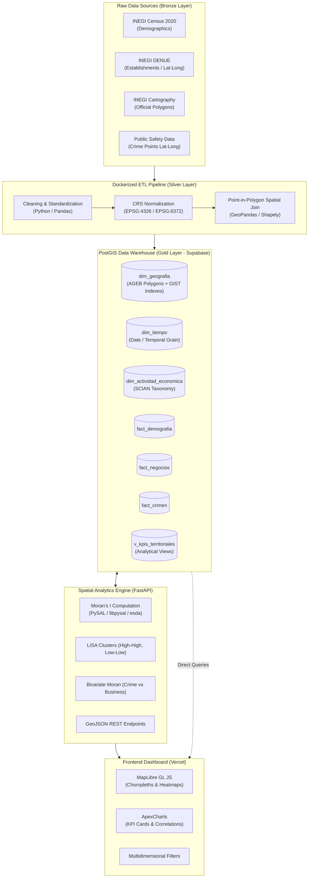
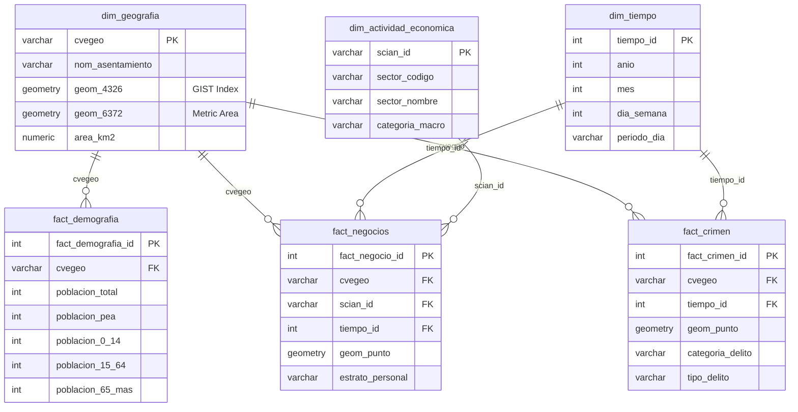

# 🏙️ Mérida Urban Intelligence: Geospatial Data Warehouse & Analytics Platform

[](https://github.com/RusselKu/Merida-Urben-Intelligence-By-Sunchos-Team/actions/workflows/ci.yml)
[](https://www.postgresql.org/)
[](https://postgis.net/)
[](https://fastapi.tiangolo.com/)
[](https://reactjs.org/)
[](https://maplibre.org/)
[](https://vercel.com/)

---

## 📌 1. Project Overview

**Mérida Urban Intelligence** is an end-to-end urban analytics platform and Geospatial Data Warehouse designed for the city of Mérida, Yucatán. The system addresses the core challenge of integrating heterogeneous datasets operating at disparate spatial resolutions and formats (point-level latitude/longitude records vs. official geo-statistical polygons) to evaluate socio-spatial correlations, economic activity clusters, and public safety distributions.

### Analytical Objectives:
1. **Geospatial Consolidation**: Seamlessly integrate demographic data (INEGI Census 2020), economic activities (INEGI DENUE), official cartography, and georeferenced public safety records into a unified territorial grain.
2. **Dimensional Data Warehouse**: Design and implement a star/snowflake schema in **PostgreSQL with PostGIS enabled**, hosted on **Supabase**.
3. **Advanced Spatial Analytics**: Compute global and local spatial autocorrelation metrics (**Global Moran's I, LISA cluster maps, and Bivariate Moran's I**) via a **FastAPI** analytical engine powered by **PySAL / GeoPandas**.
4. **Interactive Visualization**: Deploy an intuitive dashboard in **React + MapLibre GL JS + ApexCharts** hosted on **Vercel** for data-driven urban policy and analysis.

---

## 🏗️ 2. System Architecture & Tech Stack



---

## 🗺️ 3. Geographic Strategy & Spatial Integration

### Territorial Unit Selection
To integrate datasets with varying native spatial granularities, three alternatives were evaluated:

| Geographic Unit | Advantages | Disadvantages | Decision |
| :--- | :--- | :--- | :--- |
| **Manzana (City Block)** | Highest spatial resolution. | Extensive statistical suppression (secreto estadístico) in demographic variables; complex polygon topology. | Rejected |
| **Urban AGEB (Basic Geo-statistical Area)** | Complete availability of census indicators (EAP, age groups); official validated boundaries; ideal balance between detail and statistical significance. | Variations in physical polygon area towards peri-urban fringes. | **SELECTED (Optimal)** |
| **Hexagonal Grids (H3 / Equal Area)** | Homogeneous cell sizes mitigating MAUP scale effects. | Disconnected from official INEGI administrative units; requires spatial interpolation with potential error propagation. | Rejected for base DW |

### Point-to-Polygon Spatial Integration (Spatial Join)
1. **Coordinate Reference System (CRS) Normalization**: All point entities (DENUE establishments and crime incident coordinates) are converted to `WGS84` (`EPSG:4326`).
2. **Topological Validation**: Filter invalid/null coordinates and points outside the official municipality boundaries of Mérida (Code `31050`).
3. **Spatial Join**: Execute spatial containment predicates (`ST_Within(point, polygon)` / `gpd.sjoin(how='inner', predicate='within')`), assigning the unique `cvegeo` identifier to each point.

---

## 🗄️ 4. Dimensional Data Warehouse Model (PostgreSQL / PostGIS)

The Data Warehouse implements a multidimensional dimensional schema optimized for aggregations and spatial queries:



---

## 📊 5. Required Key Performance Indicators (KPIs)

| Category | KPI Name | Mathematical Definition / Formula | Output Grain |
| :--- | :--- | :--- | :--- |
| **Demographic** | **Total Population** | $\sum \text{Population per AGEB}$ | AGEB |
| **Demographic** | **Population Density** | $\frac{\text{Total Population}}{\text{Area in } \text{km}^2}$ | Residents / $\text{km}^2$ |
| **Demographic** | **EAP Rate** | $\frac{\text{Economically Active Population (EAP)}}{\text{Population } \ge 12 \text{ years}} \times 100$ | Percentage (%) |
| **Demographic** | **Population by Age Group** | Headcounts and proportions for cohorts: `0-14`, `15-64`, `65+` | AGEB |
| **Economic** | **Total Businesses** | $\text{Count}(\text{DENUE Establishments})$ | Count per AGEB |
| **Economic** | **Business Density** | $\frac{\text{Total Businesses}}{\text{Area in } \text{km}^2}$ | Businesses / $\text{km}^2$ |
| **Economic** | **Businesses per 1k Residents** | $\frac{\text{Total Businesses}}{\text{Total Population}} \times 1,000$ | Rate per 1k pop |
| **Economic** | **Retail Density** | $\frac{\text{Retail Establishments (SCIAN 46-47)}}{\text{Area in } \text{km}^2}$ | Stores / $\text{km}^2$ |
| **Economic** | **Service Density** | $\frac{\text{Service Establishments (SCIAN 54-81)}}{\text{Area in } \text{km}^2}$ | Services / $\text{km}^2$ |
| **Economic** | **Dominant Economic Activity** | $\text{Mode}(\text{SCIAN Sector})$ by establishment count | Dominant sector |
| **Public Safety** | **Total Crime Incidents** | $\sum \text{Georeferenced Incidents assigned to polygon}$ | Count per AGEB |
| **Public Safety** | **Crime Rate** | $\frac{\text{Total Incidents}}{\text{Total Population}} \times 1,000$ | Incidents / 1k pop |
| **Public Safety** | **Temporal & Category Breakdown** | Incidents grouped by crime type and time-of-day window | Distribution |
| **Public Safety** | **Crime-to-Business Ratio** | $\frac{\text{Total Incidents}}{\text{Total Businesses}}$ | Relative index |

---

## 🔬 6. Spatial Analytics Engine (Phase 3)

1. **Spatial Weights Matrix ($W$)**: Standard first-order **Queen contiguity matrix** row-standardized ($W_{std}$) over Mérida AGEBs.
2. **Global Moran's I**:
   $$I = \frac{n}{\sum_{i} \sum_{j} w_{ij}} \frac{\sum_{i} \sum_{j} w_{ij} (x_i - \bar{x})(x_j - \bar{x})}{\sum_{i} (x_i - \bar{x})^2}$$
   Statistical inference evaluated against 999 Monte Carlo permutations to compute pseudo p-values and z-scores.
3. **Local Spatial Autocorrelation (LISA / Local Moran's I)**:
   - **High-High (Hotspots)**: High values surrounded by high-value neighbors.
   - **Low-Low (Coldspots)**: Low values surrounded by low-value neighbors.
   - **Spatial Outliers**: *High-Low* and *Low-High*.
4. **Bivariate Moran's I**:
   Cross-correlation between an attribute $x$ and the spatial lag of another attribute $Wy$ (e.g., Commercial Density vs Public Safety Incidents).

---

## 📂 7. Repository Directory Structure

```text
merida-urban-intelligence/
├── .github/
│   └── workflows/
│       └── ci.yml                 # Automated CI/CD workflow
├── data/
│   ├── raw/                       # Immutable raw datasets (Census, DENUE, Shapefiles)
│   └── processed/                 # Generated intermediate GeoJSONs and layers
├── docs/
│   ├── data_dictionary.md         # Data dictionary and field specs
│   └── warehouse_model.png        # Dimensional ERD diagram
├── notebooks/
│   ├── 01_data_profiling.ipynb    # Data source profiling & spatial join POC
│   ├── 02_spatial_join_test.ipynb # Point-to-polygon validation
│   └── 03_moran_analytics.ipynb   # Global Moran, LISA & Bivariate analysis
├── outputs/
│   ├── figures/                   # Exported correlation plots & Moran scatterplots
│   └── maps/                      # Exported choropleth maps & GeoJSON layers
├── sql/
│   ├── 01_schema.sql              # PostGIS extensions, dimensions, and facts DDL
│   ├── 02_load.sql                # Data loading and integrity constraints
│   └── 03_views.sql               # Analytical views for required KPIs
├── src/
│   ├── backend/                   # FastAPI REST API with PySAL & Supabase SDK
│   ├── etl/                       # Medallion Architecture Python pipeline
│   └── frontend/                  # React dashboard + MapLibre GL JS + ApexCharts
├── .dockerignore                  # Docker build context exclusions
├── .env.example                   # Environment configuration template
├── .gitignore                     # Git exclusion rules
├── BEST_PRACTICES.md              # Code standards, Conventional Commits & PR rules
├── TEAM_DISTRIBUTION.md           # Team roles, deliverable matrix & rubric alignment
├── Dockerfile                     # Geospatial container definition (GDAL/GEOS/PROJ)
├── docker-compose.yml             # Container orchestration
├── requirements.txt               # Pinned Python dependencies
└── README.md                      # Primary project documentation
```

---

## 🚀 8. Reproduction & Setup Instructions

### Prerequisites
* **Python** 3.10+
* **Node.js** 18+
* **Docker & Docker Compose**
* **Supabase** account with an active PostgreSQL project

### Step 1: Clone Repository & Configure Environment
```bash
git clone https://github.com/RusselKu/Merida-Urben-Intelligence-By-Sunchos-Team.git
cd Merida-Urben-Intelligence-By-Sunchos-Team
cp .env.example .env
```
*Edit `.env` with your Supabase credentials and database connection string.*

### Step 2: Python Virtual Environment Setup
```bash
python -m venv .venv
# On Windows PowerShell:
.\.venv\Scripts\Activate.ps1
# On Linux / macOS:
source .venv/bin/activate

pip install --upgrade pip
pip install -r requirements.txt
```

### Step 3: Run Database Schema on Supabase
Execute the SQL scripts in the Supabase SQL Editor:
1. `sql/01_schema.sql` (Enables PostGIS, dimensions, facts, and GIST indexes).
2. `sql/03_views.sql` (Creates analytical views for direct KPI queries).

### Step 4: Run the Reproducible ETL Pipeline
```bash
# Using Python directly:
python src/etl/run_pipeline.py

# Or using Docker:
docker compose up --build etl-pipeline
```

### Step 5: Start the FastAPI Backend
```bash
uvicorn src.backend.main:app --reload --port 8000
```
*Interactive API documentation is available at:* `http://localhost:8000/docs`

### Step 6: Start the Frontend Application
```bash
cd src/frontend
npm install
npm run dev
```
*Dashboard will be available at:* `http://localhost:3000`

---

## ⚠️ 9. Assumptions, Caveats & Limitations

1. **Modifiable Areal Unit Problem (MAUP)**:
   Aggregating point incidents and business records into AGEB polygons introduces potential scale and zone configuration effects. Findings should be interpreted as ecological patterns without committing ecological fallacies.
2. **Crime Reporting Bias (Dark Figure of Crime)**:
   Incident datasets represent reported offenses. Areas with varying citizen reporting rates may reflect differences in reporting tendencies rather than actual incidence.
3. **Boundary Effects (Edge Effects)**:
   Peripheral AGEBs on the outskirts of Mérida have fewer spatial neighbors, which can affect the sensitivity of spatial weight matrices. Distance-based $k$-NN neighbor models are evaluated to ensure robustness.

---

## 👥 10. Development Team (Sunchos Team)

* **Russel** — Data Architecture, Docker & PostGIS ETL Pipeline *(Phase 1 & 2)*
* **Rivaldo** — Backend FastAPI & Spatial Autocorrelation (PySAL / Moran's I) *(Phase 2 & 3)*
* **Damián** — Frontend, MapLibre GL JS & Vercel Deployment *(Phase 3)*
* **Bianca** — Data Analytics, KPI Formulation & ApexCharts *(Phase 1 & 3)*
* **Jonathan** — Data Profiling, Dimensional Modeling & Technical Report *(Phase 1 & Final)*

👉 For complete role details and workflow standards, see [`TEAM_DISTRIBUTION.md`](./TEAM_DISTRIBUTION.md) and [`BEST_PRACTICES.md`](./BEST_PRACTICES.md).
