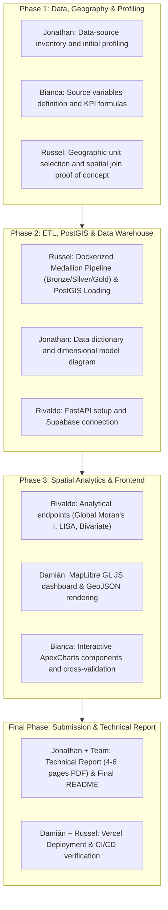

# 👥 Team Distribution & Responsibility Matrix

## Project: Mérida Urban Intelligence — Geospatial Data Warehouse & Analytics Platform

This document outlines the roles, deliverables, commitments, and collaboration strategy for the **Sunchos Team** to ensure 100% compliance with the project rubric and guarantee individual, verifiable Git contributions across all phases.

---

## 🧭 Roles & Complexity Summary

| Member | Primary Role | Complexity Level | Key Phases | Core Technologies |
| :--- | :--- | :--- | :--- | :--- |
| **Russel** | **Data Architecture & ETL Lead** | High | Phase 1 & 2 | Docker, Python, GeoPandas, Supabase (PostgreSQL / PostGIS) |
| **Rivaldo** | **Backend & Spatial Analytics** | High | Phase 2 & 3 | FastAPI, Python (PySAL, libpysal, esda), Supabase SDK |
| **Damián** | **Frontend & Interactive GIS** | High | Phase 3 | React / Next.js, MapLibre GL JS, Vercel, Tailwind / CSS |
| **Bianca** | **Data Analysis & Visualizations** | Medium | Phase 1 & 3 | Python (Profiling), React, ApexCharts, Pandas |
| **Jonathan** | **Documentation & QA Lead** | Medium | Phase 1 & Final | Data Profiling, ERD/Dimensional Diagrams, Markdown, LaTeX/PDF |

---

## 📋 Responsibility Matrix by Phase

---

## 🎯 Individual Deliverables Breakdown

### 1. Russel — *Data Architect & Lead ETL Engineer*
* **Phase 1**:
  - Evaluation and justification of optimal geographic unit (Urban AGEB vs Blocks vs Hexagonal grids).
  - Spatial point-to-polygon integration test (mapping latitude/longitude crime & business records to Mérida polygons).
* **Phase 2**:
  - Reproducible **Docker** environment (`Dockerfile`, `docker-compose.yml`).
  - **Medallion Architecture ETL Pipeline**:
    - *Bronze Layer*: Ingestion of raw sources without mutation (INEGI Census 2020, DENUE, Cartography, Crime Incidents).
    - *Silver Layer*: Type standardization, CRS normalization (`EPSG:4326` / `EPSG:6372`), point-to-polygon spatial joins.
    - *Gold Layer*: Loading into **PostgreSQL / PostGIS** dimensional warehouse on Supabase.
  - SQL DDL scripts (`sql/01_schema.sql`), spatial GIST indexes, and loading constraints (`sql/02_load.sql`).
* **Phase 3 & Final**:
  - Database optimization, spatial indexing performance, and analytical view definitions (`sql/03_views.sql`).

---

### 2. Rivaldo — *Backend & Geospatial Analytics Engineer*
* **Phase 2**:
  - **FastAPI** server structure (`src/backend/`).
  - Connection pooling to Supabase PostgreSQL and Supabase SDK integration.
  - REST endpoints serving territorial GeoJSON layers and consolidated KPIs.
* **Phase 3**:
  - **Spatial Autocorrelation** algorithms using **PySAL** (`libpysal`, `esda`):
    - **Global Moran's I**: Metric computation ($I$, p-value, z-score) for at least two territorial indicators.
    - **Local Moran's I (LISA)**: Cluster detection (High-High hotspots, Low-Low coldspots) and spatial outliers.
    - **Bivariate Moran's I**: Cross-spatial relationships (e.g., Commercial Density vs Crime Incidents).
  - Definition and justification of the spatial weights matrix ($W$) (Queen/Rook contiguity or $k$-NN).
  - High-performance analytical API endpoints for frontend consumption.

---

### 3. Damián — *Frontend & GIS Visualization Engineer*
* **Phase 2**:
  - **React / Next.js** application setup with Supabase environment variables support.
  - Continuous deployment configuration on **Vercel**.
* **Phase 3**:
  - **MapLibre GL JS** integration for interactive choropleth and thematic mapping.
  - Dynamic GeoJSON layer rendering (Mérida AGEB boundaries, crime heatmaps, LISA clusters).
  - Responsive UI with metric selectors, interactive tooltips, opacity sliders, and category/temporal filters.
  - Global map state management synchronized with the analytics charts panel.

---

### 4. Bianca — *Data Analyst & Data Visualization Specialist*
* **Phase 1**:
  - Source data auditing: numeric and categorical profiling of INEGI Census and DENUE.
  - Mathematical formulation of all 12+ required KPIs:
    - *Demographic*: Total population, density, economically active population rate, age group distribution.
    - *Economic*: Total businesses, business density, businesses per 1,000 residents, retail/service density, dominant sector.
    - *Public Safety*: Total incidents, crime rate per 1,000 residents, temporal distribution, crime-to-business ratio.
* **Phase 3**:
  - Interactive data visualization components using **ApexCharts** in React.
  - Correlation analysis plots (Pearson / Spearman), economic breakdown charts, crime time series.
  - Cross-validation of frontend metric calculations against Data Warehouse SQL views.

---

### 5. Jonathan — *QA, Profiling & Technical Documentation Lead*
* **Phase 1**:
  - Data quality evaluation (analysis of missing values, duplicates, CRS consistency, CVEGEO codes).
  - Comprehensive **Data Dictionary** (`docs/data_dictionary.md`).
* **Phase 2**:
  - Dimensional modeling diagram (ERD in Mermaid / PNG covering `dim_geografia`, `dim_tiempo`, `dim_actividad_economica`, `fact_demografia`, `fact_negocios`, `fact_crimen`).
  - Referential integrity validation queries.
* **Phase Final**:
  - Authoring and formatting of the **Final Technical Report (4 to 6 pages PDF)** covering problem statement, methodology, warehouse architecture, spatial analytics, and key findings.
  - Continuous maintenance and review of the repository `README.md`.

---

## ⚡ Anti-Bottleneck Parallel Workflow

To ensure continuous progress across all team members:

1. **Week 1 (Phase 1)**:
   - While **Russel** provisions Docker and tests spatial join pipelines, **Jonathan** and **Bianca** work directly on data profiling notebooks (`notebooks/01_data_profiling_and_spatial_integration.ipynb`) auditing CSVs and defining metric formulas.
2. **Week 2 (Phase 2)**:
   - While **Russel** loads processed data into Supabase PostGIS, **Rivaldo** structures FastAPI endpoints with initial mocks, and **Jonathan** writes the `data_dictionary.md` and dimensional model diagram.
3. **Week 3 (Phase 3)**:
   - **Rivaldo** connects FastAPI to PostGIS and calculates Moran's I metrics in Python.
   - **Damián** sets up the MapLibre canvas in React and **Bianca** builds ApexCharts KPI cards and correlation graphs.
4. **Week 4 (Final Phase)**:
   - **Jonathan** authors the 4–6 page PDF technical report integrating maps, LISA cluster plots, and KPI validation tables.

---

## 📊 Evaluation Rubric & Point Distribution (100 pts)

| Evaluation Component | Points | Primary Leads |
| :--- | :---: | :--- |
| **Data & Geographic Assessment** | 15 pts | Russel, Bianca, Jonathan |
| **ETL, Spatial Integration & Reproducibility** | 20 pts | Russel |
| **PostgreSQL/PostGIS DW Design & Implementation** | 20 pts | Russel, Jonathan |
| **KPIs & Spatial Analysis (Moran / LISA)** | 15 pts | Rivaldo, Bianca |
| **Repository Collaboration & Git History** | 20 pts | **All Team Members (100% Mandatory)** |
| **Documentation & Technical Report** | 10 pts | Jonathan, All Team Members |
| **TOTAL** | **100 pts** | |

> [!IMPORTANT]
> **Strict Git Collaboration Requirement:**
> 20% of the project grade is evaluated directly from individual Git commit history. Every team member must create dedicated feature branches (`feature/...`), submit Pull Requests, and write descriptive commit messages across all project phases.
