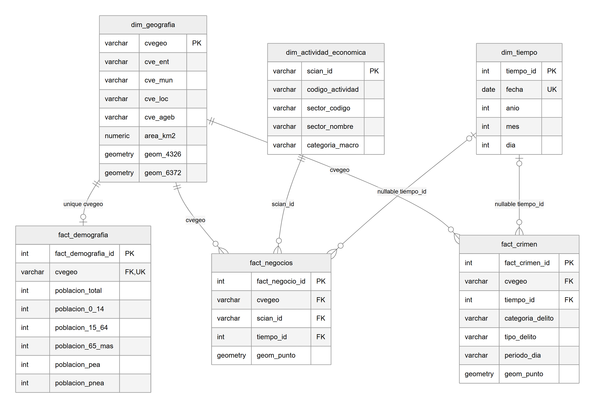
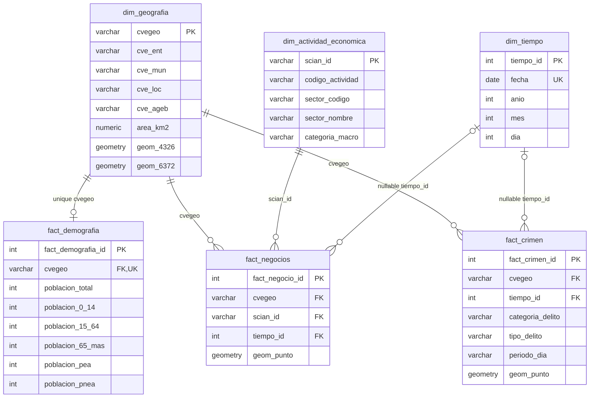

# Implemented dimensional model

Owner: Jonathan. Reviewed: 2026-10-04. Source: [01_schema.sql](../sql/01_schema.sql).

The model contains three dimensions and three fact tables sharing the urban AGEB territorial key. The diagram shows actual DDL keys; the [dictionary](data_dictionary.md) covers all descriptive fields. A [PNG export](warehouse_model.png) is available for the PDF report.





| Table | Grain and effective cardinality |
| --- | --- |
| `dim_geografia` | One AGEB; may exist without associated facts |
| `dim_tiempo` | One date; a fact may have no date because its FK is nullable |
| `dim_actividad_economica` | One SCIAN class according to the DENUE code |
| `fact_demografia` | Zero or one row per AGEB, enforced by UQ on `cvegeo`; no census time dimension |
| `fact_negocios` | One inserted row per establishment; many per AGEB/activity; source identity and snapshot are not yet preserved |
| `fact_crimen` | One intended row per incident; many per AGEB; source and load pending |

`v_kpis_territoriales` aggregates businesses and crime before joining geography and demographics, avoiding incident/establishment multiplication from direct fact-to-fact joins. Its final grain remains one AGEB, with no date filters.

Geography FKs cascade-delete facts when their AGEB is deleted. Other FKs do not declare cascading deletion. Four GiST indexes exist: two on geography and one on each point fact. All six tables have RLS enabled with public SELECT policies; the view uses invoker permissions.

## Reproduce the PNG

The PNG is rendered from the Mermaid block above using Mermaid 11.12.0, white background and 2× raster resolution. Extract the block without Markdown fences to a temporary `.mmd` file, then render with Mermaid CLI:

```bash
npx --yes @mermaid-js/mermaid-cli@11.12.0 -i warehouse_model.mmd -o docs/warehouse_model.png -b white -s 2
```

The browser renderer and its layout dependencies may vary the pixel dimensions; the source diagram and relationships remain authoritative. Regenerate the PNG when modifying this block.

## Decisions before extending the model

1. Agree with Russel on DENUE establishment identity and snapshot handling to prevent duplicate reloads.
2. Decide whether demographics should retain multiple census editions; currently reloads replace each AGEB row.
3. Agree on crime source, incident identifier, date and catalog before populating `fact_crimen` and `dim_tiempo`.
4. Distinguish SCIAN class names from two-digit sector names.
5. Document AGEB boundary/edition changes across sources before treating them as equivalent units.

These are proposals for team review; this change does not modify the DDL.
